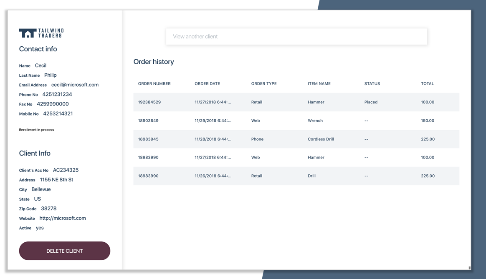
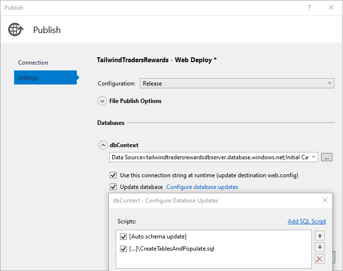
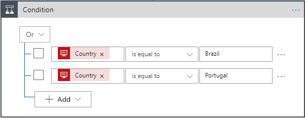
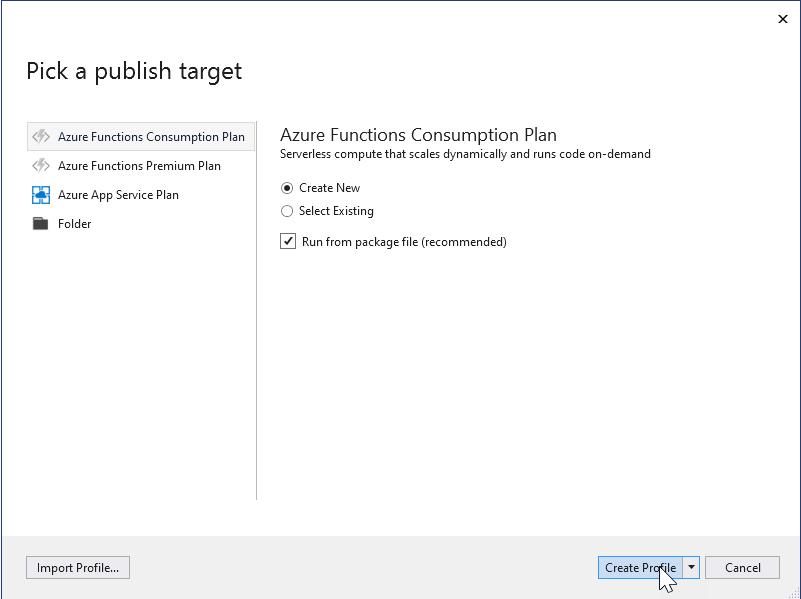

# Tailwind Traders Rewards - Sample Reference Application 

The customer service at [Tailwind Traders](https://github.com/Microsoft/TailwindTraders) use the following application to identify potential customers and request to enroll them in the loyalty program called "Rewards". In the application we have the customer information, their order history, a search bar to look for other customers and a checkbox to request to enroll the customer in the program. 



You can take a look at our live running website following this address: [https://rewards.tailwindtraders.com](https://rewards.tailwindtraders.com) 

## Technical Information

1. The application was built with .NET Framework 3.5 using ASP.NET Web Forms.
1. The application is connected to a SQL Server Database.
1. You can either run the Azure Durable Function or create a Logic App workflow in order to automate the enrollment process. Depending on what you want to showcase or learn you can use either, the Azure Function use a [Twilio](https://www.twilio.com) account to send SMS or [SendGrid](https://docs.microsoft.com/en-us/azure/sendgrid-dotnet-how-to-send-email) to send an email, this workflow waits for an approval, while the Logic App just send a welcome email to the customer.

We use Azure Pipelines in order to manage the CI/CD process of this application, you can take a look at the project:
[](https://dev.azure.com/TailwindTraders/Rewards/_build/latest?definitionId=28)

> Note: In the **web.config** file of the website project, in line 43 and 44 you can setup the credentials required to get into the Administration dashboard to add, modify or delete the sample data of the customers.

# Getting Started

The following guide covers the step by step of how to deploy the application to Azure, create the Logic App workflow or deploy the Azure Function in order to automate the enrollment process. After doing this guide you will be able to follow the [demo script](https://github.com/Microsoft/TailwindTraders/tree/master/Documents/DemoScripts/Modernizing%20.NET%20Apps#modernizing-net-apps).

## Before you begin

1. You will need Visual Studio 2015 or later.

1. You will need an active [Azure Subscription](https://github.com/Microsoft/TailwindTraders#new-to-microsoft-azure) in order to follow this guide.

1. If you want to run the Azure Durable Function you will need an active SendGrid or Twilio account.

## Deployment Guide

### 1. Open the Website Solution

Clone the repository and open the **Source** folder, there you will find the **TailwindTraders.Rewards.Website.sln**. Open the solution and right click on the project called **TailwindTraders.Rewards.Website**. Go to Publish and then click on **Start**.

 

### 2. Create the Azure Resources

From the window screen called **Pick a publish target** select **App Service** and then **Create New**. Select your subscription, provide or change the name of your Azure App Service, create or select a hosting plan for your Azure App Service and also create a SQL Database and Azure SQL Server.


Optionally, we have added an ARM template to automate the creation of the resources required for this app, you can also deploy the resources using the following button:

[](https://portal.azure.com/#create/Microsoft.Template/uri/https%3A%2F%2Fraw.githubusercontent.com%2FMicrosoft%2FTailwindTraders-Rewards%2Fmaster%2FDeploy%2Fdeployment.json)

> Note: This will create all the resources that you need, including: Azure Function, Azure Logic App, Storage, Azure App Service, App Service Plan, Azure SQL Database and Azure SQL Server.

An alternative option is to execute the following script in order deploy to Azure using *az cli* tools:

```
.\Deploy\gen-infrastructure.ps1 -resourceGroup <resource-group-name> -location <location-name> -subscription <subscription-id> -sqlAdminName <sql-admin-name> -sqlAdminPassword <sql-admin-password>
```

- `resourceGroup`: The name of your resource group where all infrastructure will be created `Required`
- `location`: Select where you want to create your resource group, for example: `eastus` `Required`
- `sqlAdminName`: Name of your SQL admin user `Required`
- `sqlAdminPassword`: Password of your SQL admin user `Required`
- `subscription`: Id of your subscription where you are going to deploy your resource group `Required`

### 3. Publish the website project

Using the Azure resources and the profile you just created, publish the application with Visual Studio. 

You will need to execute the SQL script located in **Source/SQLScripts** folder in order to feed the database with sample data. If you create the Azure resources from Visual Studio, remember that you will need to set a firewall exception in the SQL Azure Database. If you use the ARM provided the firewall rule will be already created.

Optionally you can also execute the SQL script as part of the publishing profile using the **Update database** configuration.



### 4. Create the Azure Logic App (Optional - Used in the Demo Script)

The following step-by-step guide will help you to create the Azure Logic App required by this application:

1. If you used the ARM template provided open the Logic App, if not from the Azure portal, create a new one, then click the **Logic app designer**

    

1. Click **Blank Logic App** to create a blank logic app.

    

1. Search for **SQL Server** in the search bar, select **SQL Server** and then select the **When an item is modified** trigger.

    

1. Provide the **SQL Server** credentials and choose the database and click **Create**. 

    

1. In the resulting window, choose **Customers** as the SQL table, set the **interval** as *10* and **Frequency** as *Seconds*. Click the **+ New step** icon to create a new step.

    

1. Search for **SQL** in the search box and choose **Get row** as the corresponding action.

    

1. In the next window, select **Customers** as the Table name. Click the **Add dynamic content** below the **Row Id** textbox and select **Email** as the identifier for the **Row id** field. Click the **+ New step** icon to create a new step.

    
    

1. In the search box, enter **condition** as your filter. Select this action: *Condition - Control*. Change the clause to **Or**, choose **Country** as the dynamic content for both the rows **Brazil** and **Portugal** as values.

    

1. Under **If true** and **If false**, add the steps to perform based on whether the condition is met. Let's look at **If true**. Insert a new action **microsoft translator v2** and choose **translate text(preview)** under **Actions**. 

    

1. Choose the **Target Language** as **Portuguese** and add the **Text** as in the below picture. Choose *FirstName, LastName, AccountCode* from the dynamic content list. 

    `Welcome to our rewards program ['FirstName']['LastName']
Your account code is ['AccountCode']`


1. In the search bar, type **Send an email** and select the **Send and Email** action to configure and send the email.

    

    > You need to sign in with a valid Office 365 or Microsoft Account.

    

1. Instead of using the **Dynamic Content** from the database and get the **email** field we are going to use a **valid email** where you want to receive the emails. Fill the **Subject** as *Tailwind Traders Rewards* and choose **Translated text** from dynamic content for **Body**.

    
    
1. Under **If false**, let's add an action **Send an email** from the search bar and select the **Send an email** action to configure and send the email. Use the same email used in the previous step, fill the **Subject** as *Tailwind Traders Rewards* and use *Dynamic Content* to write the email **Body** as shown in the picture.

    
    
### 5. Publish the Azure Function (Optional)

> Note: You will need an active SendGrid or Twilio account in order to use the Azure Durable Function.

1. You will need to change the **web.config** file of the Rewards Web Project (Line 41) in order to use the Azure Function instead of the Logic App.
```
<add key="ByPassLogicApp" value="true"/>
```

1. Open the **Source** folder, there you will find the **TailwindTraders.Rewards.Function.sln**, open the solution.

1. Fill the required values of the **local.settings.json** file.

> Note: In case you want to use the SMS Reply setting, you will need to create a webhooks in Twilio with the same URL of the Azure Function. If “UseSMSReply” is set to “false” (by default) this is not required.

> If you want to use [Azure API Management](https://azure.microsoft.com/services/api-management) you can create an additional setting called **APIM_SubsKey** with the value of the API Management Key.

1. Right click on the project called **TailwindTraders.Rewards.Function**. Go to Publish and then click on **Start**. 

If you created the Azure resources using the ARM template provided then create a new profile selecting the Function that is already there, if not, using the Publishing Tools create a new resource.



# Demo Script
Once you have completed the deployment, you can find a [demo script](https://github.com/Microsoft/TailwindTraders/tree/master/Documents/DemoScripts/Modernizing%20.NET%20Apps#modernizing-net-apps) with the walkthroughs of how to demonstrate the application using the Logic App workflow.

# Resources

If you want to cover more technical details about the services and tools we use in this application you can explore the following list of courses and documentation:

- [ASP.NET Web Forms](https://dotnet.microsoft.com/apps/aspnet/web-forms)
- [Azure App Service](https://docs.microsoft.com/en-us/azure/app-service/)
- [Azure Logic Apps](https://docs.microsoft.com/en-us/azure/logic-apps/logic-apps-overview)
- [Azure Durable Function](https://docs.microsoft.com/en-us/azure/azure-functions/durable/durable-functions-overview)
- [Visual Studio](https://visualstudio.microsoft.com/)

# Contributing

This project welcomes contributions and suggestions.  Most contributions require you to agree to a
Contributor License Agreement (CLA) declaring that you have the right to, and actually do, grant us
the rights to use your contribution. For details, visit https://cla.microsoft.com.

When you submit a pull request, a CLA-bot will automatically determine whether you need to provide
a CLA and decorate the PR appropriately (e.g., label, comment). Simply follow the instructions
provided by the bot. You will only need to do this once across all repos using our CLA.

This project has adopted the [Microsoft Open Source Code of Conduct](https://opensource.microsoft.com/codeofconduct/).
For more information see the [Code of Conduct FAQ](https://opensource.microsoft.com/codeofconduct/faq/) or
contact [opencode@microsoft.com](mailto:opencode@microsoft.com) with any additional questions or comments.